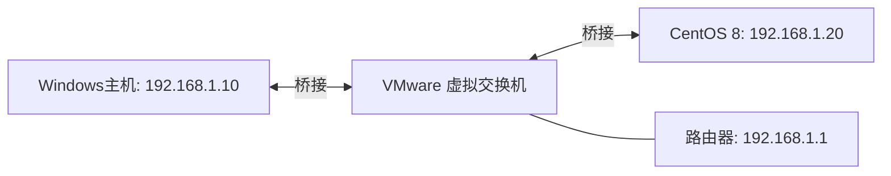

#  SSH远程开发

# 1. 基本介绍
SSH（Secure Shell）是一种用于在不安全网络上安全地访问远程主机的协议。它可以对数据进行加密，提供远程登录、文件传输和命令执行等功能，是Linux系统管理和远程开发的基础工具。

# 2. 环境准备

## VMware虚拟机配置
在VMware中设置桥接模式：

- 在VMWare Workstation软件中，顶部菜单栏找到"编辑"->"虚拟网络编辑器"，在弹出的窗口中点击"添加网络"，选择VMNet0，点击"确定"完成添加。
- 在"虚拟网络编辑器"窗口中，选择刚才添加的网络VMNet0，将"连接类型"设置为"桥接模式"，点击"确定"保存设置.
- 桥接至物理网络适配器：不要用默认的"自动"！请选择你当前使用的物理网络适配器（例如以太网适配器或无线适配器），点击"确定"保存设置。
- 在VMWare Workstation软件中，顶部菜单栏找到"虚拟机"->"设置"，将"网络适配器"的"网络连接"设置为"桥接模式"。


CentOS以桥接模式连接网络，获得与主机同网段的IP地址，方便SSH连接和远程开发。桥接模式下，虚拟机直接连接到物理网络，相当于网络中的一台独立主机。



### 查看虚拟机IP地址

```bash
# 查看IP地址
ip addr show

# 测试网络连通性
ping baidu.com          # 外网
```

如果CentOS右上角找不到网络连接的图标，可以尝试以下命令重启网络服务：

```bash
# 重启网络服务
systemctl restart NetworkManager
```

# 3. VS Code Remote-SSH安装与配置
在Windows主机上可以使用多种方式，连接虚拟机。
包括使用PuTTY等SSH客户端工具，或者直接在CMD/PowerShell中使用SSH命令行工具进行连接。

使用VS Code的Remote-SSH扩展，也可以直接在远程CentOS服务器上进行开发。

## 安装Remote-SSH扩展

1. 打开VS Code
2. 点击左侧活动栏的**扩展图标**（或按 `Ctrl+Shift+X`）
3. 在搜索框中输入 "Remote - SSH"
4. 找到由Microsoft发布的 **Remote - SSH** 扩展
5. 点击**安装**

安装完成后，VS Code左下角会出现一个远程连接图标（><），表示Remote-SSH扩展已就绪。

## 配置SSH连接

有两种方式可以配置SSH连接：

### 方式一：通过命令面板配置

1. 按 `Ctrl+Shift+P` 打开命令面板
2. 输入 **Remote-SSH: Connect to Host...**
3. 选择 **Add New SSH Host...**
4. 输入SSH连接命令：
   ```
   ssh lenovo@192.168.1.20
   ```
5. 选择SSH配置文件保存位置（通常选择默认的 `C:\Users\用户名\.ssh\config`）
6. 连接成功后，左下角会显示 **SSH: centos8-vm**

### 方式二：直接编辑SSH配置文件

也可以手动编辑SSH配置文件 `C:\Users\用户名\.ssh\config`：

```
Host centos8-vm
    HostName 192.168.1.20
    User lenovo
    Port 22
```

配置完成后即可直接选择该主机进行连接。

## 连接远程服务器

1. 点击左侧活动栏的**远程连接图标**（><）
2. 在 **SSH Targets** 中可以看到配置的主机
3. 点击主机旁边的**连接图标**（或右键选择 **Connect to Host in New Window**）
4. 在弹出的对话框中选择平台：**Linux**
5. 等待VS Code在远程服务器安装VS Code Server
6. 连接成功后，左下角会显示 **SSH: centos8-vm**

首次连接时，VS Code会自动在远程服务器上下载并安装VS Code Server，这是VS Code远程开发的核心组件。

# 4. 远程开发使用

## 打开远程文件夹

1. 连接成功后，点击 **文件 → 打开文件夹**
2. 选择要打开的远程目录（如 `/home/lenovo/projects`）
3. 点击 **确定**，VS Code会在远程目录下创建 `.vscode` 配置

## 远程终端

```bash
# 连接成功后，按 Ctrl+` 打开远程终端
# 终端运行在远程服务器上，可以执行任何Linux命令

# 查看当前工作目录
pwd

# 查看文件列表
ls -la

# 运行Python脚本
python3 script.py

# 编译C程序
gcc main.c -o main && ./main
```

## 文件传输

VS Code Remote-SSH支持直接在本地和远程之间传输文件：

- **上传文件**：在资源管理器中拖拽文件到远程文件夹
- **下载文件**：右键远程文件 → **Download...**
- **复制粘贴**：使用快捷键在本地和远程之间复制文件内容

也可以使用命令行传输文件：

```powershell
# 使用scp上传文件（在本地PowerShell中执行）
scp local_file.txt lenovo@192.168.1.20:/home/lenovo/

# 使用scp下载文件
scp lenovo@192.168.1.20:/home/lenovo/remote_file.txt ./

# 上传整个目录
scp -r local_folder/ lenovo@192.168.1.20:/home/lenovo/

# 使用rsync同步目录（更高效）
rsync -avz local_folder/ lenovo@192.168.1.20:/home/lenovo/remote_folder/
```

# 5. VS Code常用快捷键

## 通用快捷键

| 快捷键           | 说明         |
| ---------------- | ------------ |
| `Ctrl+Shift+P` | 打开命令面板 |
| `Ctrl+P`       | 快速打开文件 |
| `Ctrl+Shift+N` | 新建窗口     |
| `Ctrl+Shift+M` | 打开问题面板 |
| `Ctrl+`` ` ``  | 打开终端     |
| `Ctrl+Shift+X` | 打开扩展市场 |

## Remote-SSH专用快捷键

| 快捷键                                               | 说明         |
| ---------------------------------------------------- | ------------ |
| `Ctrl+Shift+P` → `Remote-SSH: Connect`          | 连接远程主机 |
| `Ctrl+Shift+P` → `Remote-SSH: Close Connection` | 关闭远程连接 |
| `Ctrl+Shift+P` → `Remote-SSH: Forward a Port`   | 端口转发     |
| `Ctrl+Shift+P` → `Remote-SSH: Show Log`         | 查看连接日志 |

## 编辑器快捷键

| 快捷键                | 说明               |
| --------------------- | ------------------ |
| `Ctrl+D`            | 选择下一个相同的词 |
| `Ctrl+Shift+K`      | 删除当前行         |
| `Alt+Up/Down`       | 移动当前行         |
| `Shift+Alt+Up/Down` | 复制当前行         |
| `Ctrl+/`            | 注释/取消注释      |
| `Ctrl+Shift+F`      | 全局搜索           |

通过本章学习，你应该能够：

1. 理解VMware桥接网络模式的原理和配置方法
2. 掌握CentOS 8上SSH服务的安装、配置和管理
3. 熟练使用VS Code Remote-SSH进行远程开发