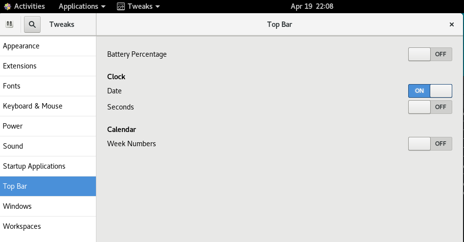
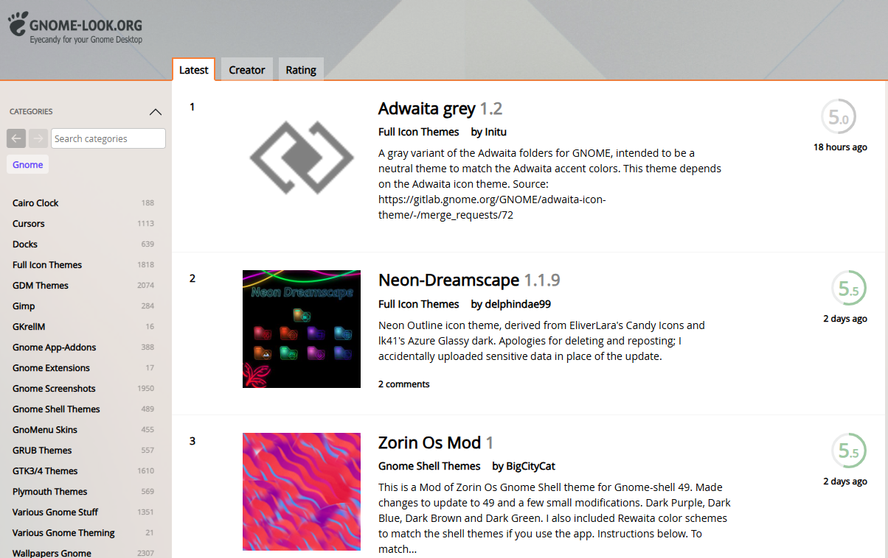
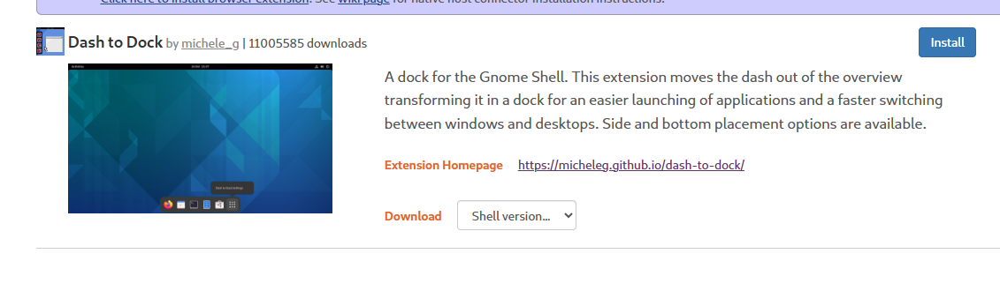

# Bash 终端环境优化与配置指南

---

## 📁 Bash 配置文件层级

| 配置文件            | 作用范围         | 加载时机      |
| ------------------- | ---------------- | ------------- |
| `/etc/profile`    | 全局所有用户     | 登录Shell     |
| `/etc/bashrc`     | 全局所有用户     | 交互式Shell   |
| `/etc/inputrc`    | 全局Readline配置 | 所有Shell启动 |
| `~/.bash_profile` | 当前用户         | 登录Shell     |
| `~/.bashrc`       | 当前用户         | 交互式Shell   |
| `~/.inputrc`      | 当前用户Readline | Shell启动时   |
| `~/.bash_logout`  | 当前用户         | 退出登录时    |

---

## ⌨️ Readline 与 inputrc 配置

### 1. 全局 inputrc 优化配置

编辑 `/etc/inputrc` 或 `~/.inputrc` 文件：

```bash
# 命令历史搜索（上下键搜索历史）
"\e[A": history-search-backward
"\e[B": history-search-forward
```

---

## 🛠️ Bash 基础环境优化

### 1. .bashrc里的Alias 别名配置

```bash
sudo yum install htop
# 添加到 ~/.bashrc 文件中
alias top='htop'
```

### 2. 桌面美化

```bash
sudo yum install gnome-tweaks
```

打开 GNOME Tweaks，在Top bar（顶部栏）中选择顶部时钟的设置，启用显示日期和秒钟。

先选择 Appearance（外观），在 Applications（应用程序）中选择喜欢的主题，如 Adwaita-dark。
更多的主题可以从 [GNOME 主题网站](https://gnome-look.org)下载并安装。

主题网站界面如下：

可以在Rating（评分）标签页中选择受欢迎的主题，点击进入后按照安装说明进行安装。
比如可以选择Candy icons主题，下载后解压到 `~/.icons` 目录下，然后在 GNOME Tweaks 的 Appearance（外观）中选择 Candy 作为图标主题。

gnome-tweaks还支持extensions（扩展），可以在 Extensions（扩展）标签页中浏览和启用各种功能增强的扩展。比如dash to dock、user themes等都是非常受欢迎的扩展，可以根据需要启用。

dash to dock 是一个非常受欢迎的 GNOME 扩展，可以将应用程序固定在屏幕边缘，提供类似于 macOS 的 Dock 功能。安装方法如下：

1. 打开 [GNOME Extensions 网站](https://extensions.gnome.org)
2. 搜索 "Dash to Dock" 扩展



3. 进入扩展页面，点击extension homepage（扩展主页）链接。
4. 需要根据gnome-shell版本选择对应的扩展版本，点击下载。

```bash
gnome-shell --version
```

5. 下载完成后解压到 `~/.local/share/gnome-shell/extensions` 目录下，
6. 重启CentOS系统。
7. 打开gnome-tweaks，在extensions（扩展）标签页中启用 Dash to Dock 扩展。

### 2. Shell增强

```bash
# 安装zsh
sudo yum install zsh
sudo yum install zsh-syntax-highlighting 
chsh -s /bin/zsh  # 切换默认Shell为zsh，重启后生效


# 添加以下内容到 ~/.zshrc 文件中
# 启用语法高亮
source /usr/share/zsh-syntax-highlighting/zsh-syntax-highlighting.zsh
```

---
